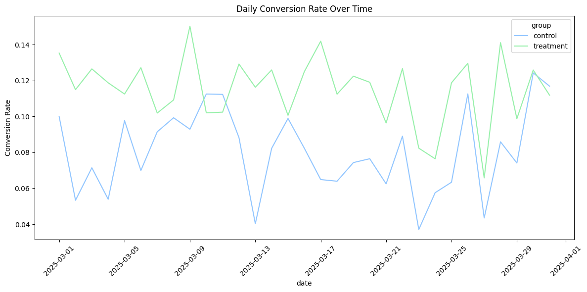

# Evaluating New Marketing Campaign Performance (A/B Testing)
- [Introduction](#introduction)
- [How to Use](#how-to-use)
- [Methods](#methods)
- [Results ](#results)

## Introduction
This project aims determine if a new marketing email design results in more traffic being directed towards a website's landing page. The goal is to design an experiment to test this hypothesis, generate realistic data, run the experiment, and then to analyze the findings for a statisticially significant difference between the conversion rates of the old and new email designs. Significance tests such as the Z-test and confidence intervals are used to determine if our results are statistically significant.

## How to Use

### For Direct Replication of Results
1. Download the [email_ab_testing.ipynb](email_ab_testing.ipynb) file.
2. Download the [ab_test_data.csv](ab_test_date.csv) file.
3. Ensure that the .ipynb file and the .csv file are in the same folder, or that you have made the necessary changes to the file path in the code.
4. Ensure you have the libraries numpy, pandas, scripy, statsmodels, matplotlib, and seaborn installed on your machine.
6. Run the notebook!

### For Running Your Own Experiment
1. Download the [email_ab_testing.ipynb](email_ab_testing.ipynb) file.
2. Download the [ab_testing_data.ipynb](ab_testing_data.ipynb) file.
3. Design your own mock A/B testing scenario! In the ab_testing_data.ipynb file, change the original conversion rate, the number of people who visit your site, the random seeds, etc.
4. Generate your testing data into a .csv.
5. Change the code in email_ab_testing.ipynb to use your new dataset.
6. Run the notebook!

## Methods
The experiment was first designed to reflect real-world marketing scenarios, with a focus on optimization of conversion rate from 0.08 to at least 0.1. Statistical power, level of significance, and sampling ratios were set at 0.8, 0.05, and 1 respectively; these were used in the calculation of the minimum required sample size. Then, using the sample size information, a dataset was randomly generated to reflect real-world user data. Variables included user_id, timestamp of email receipt, and conversion result. Next, the data were loaded and preprocessed, ensuring no duplicates and an adequate number of data points for analysis. The data were then subsetted to find samples: 3205 for the control group and 3205 for the treatment group. After that, the respective conversion rates, along with their standard deviations and errors, were calculated. To evaluate the model, the z-score, p-value, and 95% confidence intervals were calculated. Finally, the results were visualized for easy communication with stakeholdders.

## Results

The control and treatment groups were shown to have different conversion rates, with the control group showing 0.083 and the treatment group showing 0.115. 

Similarly, the treatment group was shown to have a slightly higher amount of converts than the control group when compared side-by-side.

A timeline graph was created to exhibit that time-series analysis might be useful in real-world A/B testing; however, as the timestamp data was randomly generated, no meaningful insights can be drawn from this graph other than the fact that the control had less conversions overall.

Significance tests showed that the findings were resoundingly legimate and able to be generalized from sample to population. First, the z-score was well within the rejection region, being an extreme enough value to determine that there is a true difference between the conversion rates in each group.

The confidence intervals were also shown to not overlap, meaning that we can say with 95% certainty that the conversion rates between the two groups are different, and that this is not due to chance.

These results conclude that we should place more stock in the new marketing email design. The new email design was statistically shown to cause an increase in conversion rate to 0.1, compared to the previous norm of 0.08. To increase the conversion rate further, more A/B testing should be done with any other aspects of the email that we suspect may be more effective!
